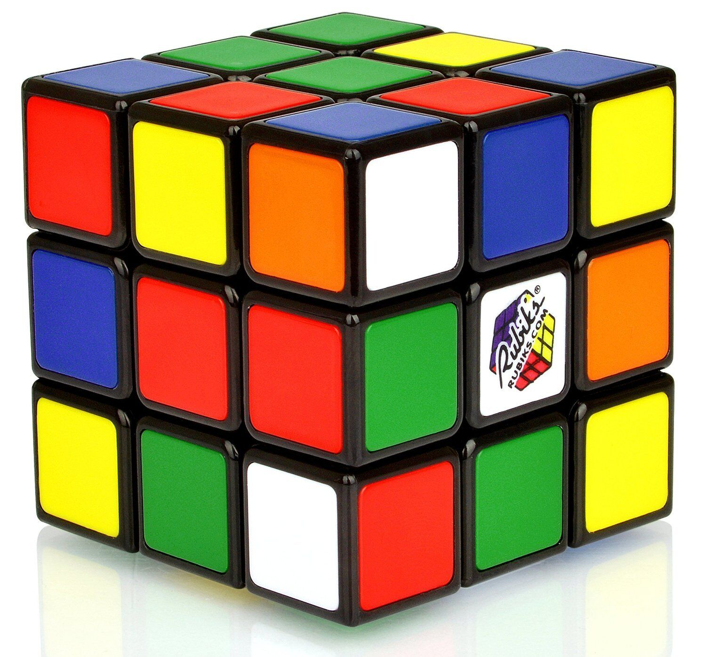
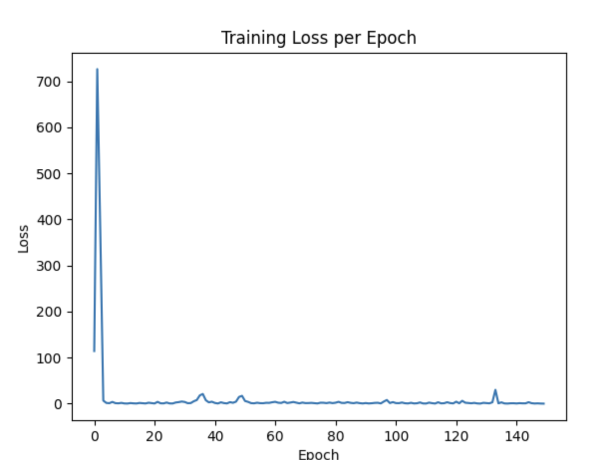
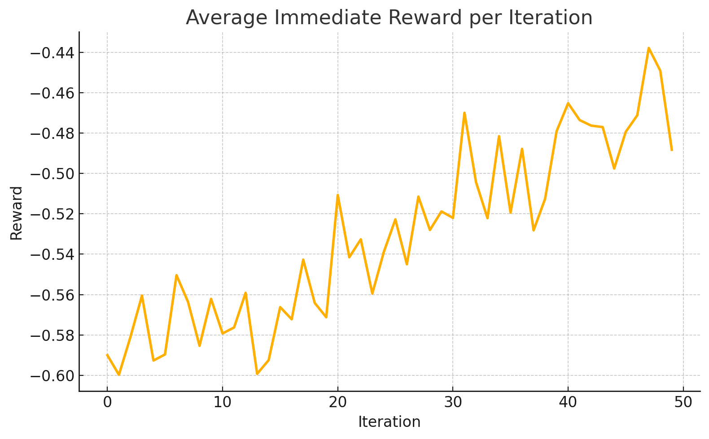

# Rubik’s Cube MCTS Runner
<p align="center">
  
</p>
This repository provides scripts to train a policy-value network for solving the Rubik’s Cube and to run Monte Carlo Tree Search (MCTS) using the trained model.

## Features

- **`train_agent.py`**: Train a policy-value network using Curriculum Learning on increasingly deep scrambles.
- **`run_mcts.py`**: Load a pretrained model and perform MCTS (with UCT) to find the next move sequence for a given scramble.

## Prerequisites

- Python 3.8 or higher
- TensorFlow 2.x
- `pycuber` for cube representation
- `numpy`, `matplotlib`

Install via:

```bash
pip install tensorflow pycuber numpy matplotlib
```

## Project Structure

```
├── cube_env.py        # Rubik’s Cube environment and encoder
├── cube_agent.py      # Generates scrambles and training batch
├── model.py           # Defines the policy-value network architecture
├── train_agent.py     # Training script (curriculum + loss/reward plots)
├── mcts.py            # MCTS implementation using the trained model
├── run_mcts.py        # Driver: load model, scramble, solve with MCTS
├── pictures/
│   ├── cube_scramble.png   # Sample scramble diagram
│   └── plot.png
│   └── reward.png
└── README.md          # This file
```

## Usage

### 1. Training a model

```bash
python train_agent.py --iterations 50 --lr 1e-3
```

- Saves model checkpoints to `saved_models/`.
- Outputs a combined loss+reward plot.


### 2. Running MCTS on a scramble

```bash
python run_mcts.py --model ./saved_models/model_20250415_it50.keras \
                    --scramble "R U R' U'"
```

- Prints the scramble and solution moves found by MCTS and BFS fallback.
- Example output:
  ```
  Keras version: 2.10.0
  Scramble formula: R U R' U''
  0.85s – MCTS solution: ['U', "B'", 'B', 'R', "U'", "R'"]
  0.01s – BFS fallback : ['U', 'R', "U'", "R'"]

  ```
### 3. Sample Plots
- Loss Plots
<p align="center">
  
</p>
- Reward Plots
<p align="center">
  
</p>

